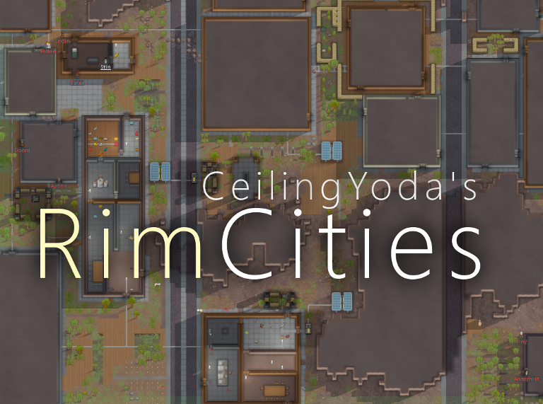
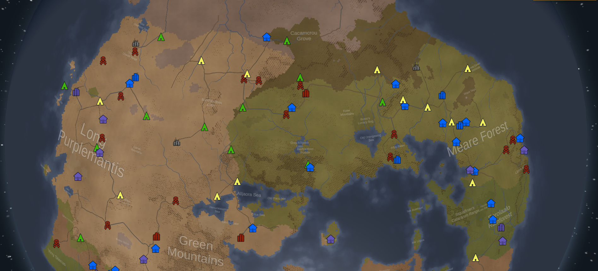
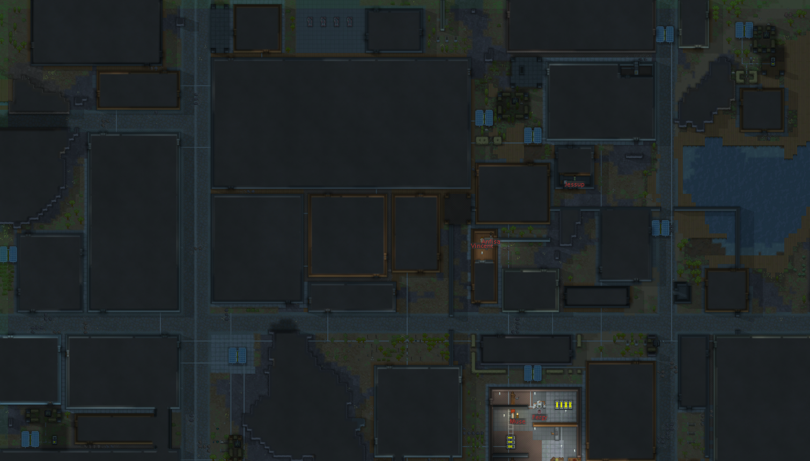
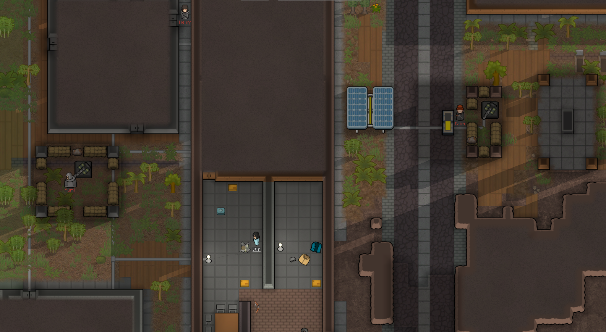
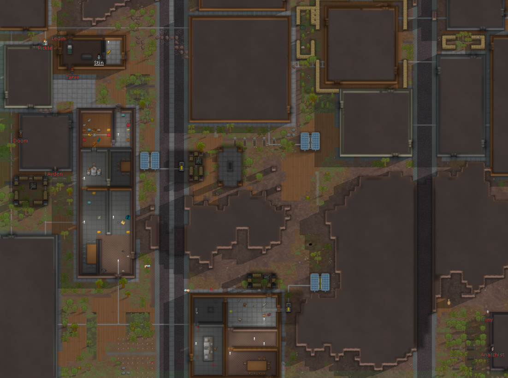
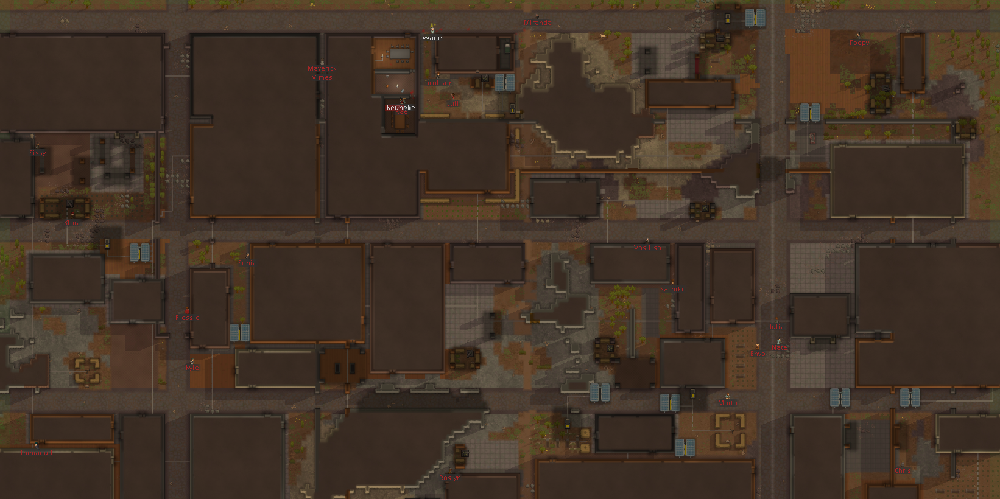

# RimCities (work in progress)
## A procedural city generator mod for RimWorld.

### [Steam Workshop](https://steamcommunity.com/sharedfiles/filedetails/?id=1775170117) | [Previous Versions](https://github.com/rvanasa/rimworld-cities/releases)

---

#### Patch v0.2.2 (June 21, 2019)
- Improved compatibility with [Combat Extended](https://steamcommunity.com/workshop/filedetails/?id=1631756268).

#### Patch v0.2.1 (June 20, 2019)
- Cities now generate in previous save files.
- You can start a new game in a friendly, hostile, or abandoned city using the "Start in a city" scenario option.
- Both abandoned and conquered cities can now be claimed and converted into player colonies.
- Friendly cities can now be visited without invoking hostilities.
- More settings are  available for city generation (check the mod options page).
- Added partial Japanese language support.

---

RimCities is an attempt to create an interesting and unique end-game challenge for RimWorld players. This mod adds randomly generated cities to the world map, which are similar to other settlements but are far more difficult to attack.

You may occasionally come across pirate-controlled cities, which provide even more of a challenge by occasionally bombarding you with mortar shells.

RimCities is currently compatible with most RimWorld mods. Let me know if you find an incompatibility and we can try to find a solution.

---

## Features:

#### Visit cities on the world map.

#### Explore large, intricate settlement layouts.

#### Scavenge for supplies and avoid defenses.

#### Reveal rooms as you progress through the map.

#### Claim conquered and abandoned cities for your faction.

---

### [Steam Workshop](https://steamcommunity.com/sharedfiles/filedetails/?id=1775170117) | [Previous Versions](https://github.com/rvanasa/rimworld-cities/releases)

If you have any ideas or suggestions, please feel free to add an issue or submit a pull request.
